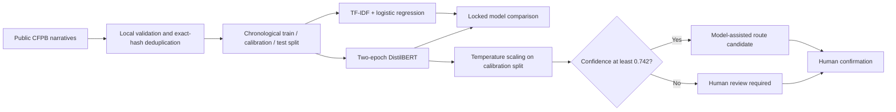
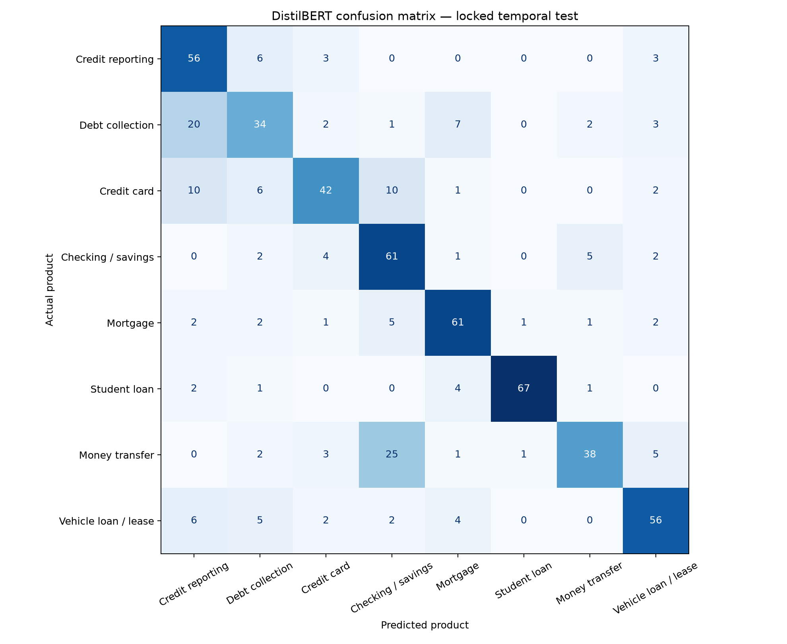
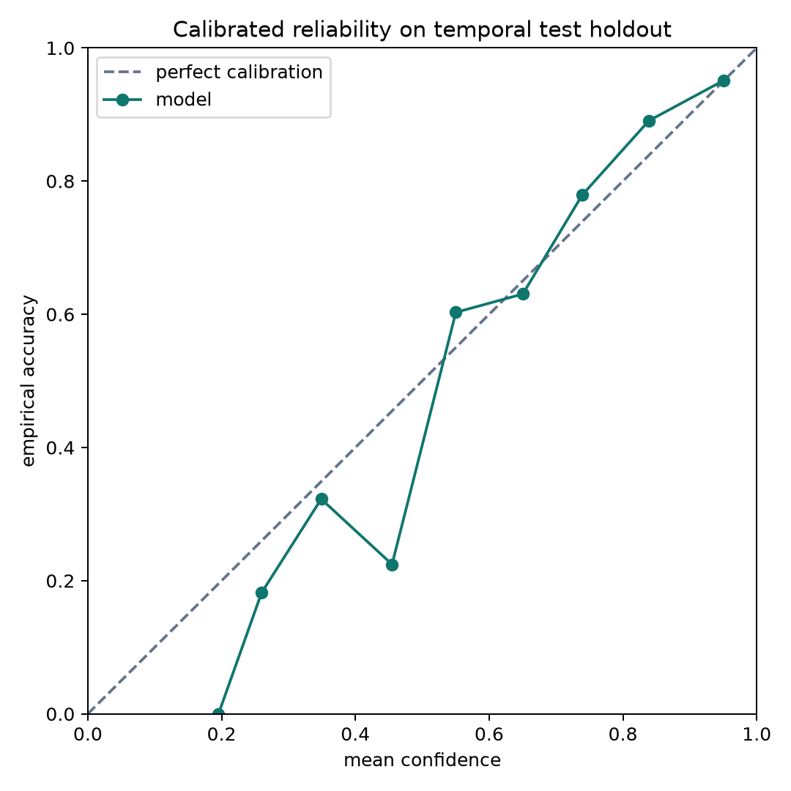

# Financial Complaint Intelligence

[](https://github.com/willykeenan/financial-complaint-intelligence/actions/workflows/ci.yml)

An evidence-first machine-learning portfolio project for classifying public financial complaint narratives, evaluating confidence calibration, and routing uncertain cases to human review.

> **Current status:** the frozen experiment completed on 2026-08-05. The classical baseline won the locked comparison; the precommitted transformer-improvement hypothesis was **not supported**. Raw complaint text is not included in this repository. Hugging Face hosting is reported only when a live link appears below.

> **Follow-up status:** a [2024 Q2 forward-holdout protocol](docs/FORWARD_HOLDOUT_PROTOCOL.md) is frozen before acquiring the new holdout. No forward-holdout result is claimed until a later commit publishes privacy-safe aggregate evidence from the unchanged models.

## What this project demonstrates

The project is designed around a practical question: can a text classifier be useful without pretending every prediction is equally trustworthy?

- **Eight-way classification:** predict the CFPB product label associated with a complaint narrative.
- **Honest comparison:** evaluate a word-and-character TF-IDF logistic-regression baseline against a fixed DistilBERT experiment.
- **Leakage-aware evaluation:** deduplicate narratives before splitting, exclude cross-label text conflicts, and split chronologically within each product.
- **Calibrated uncertainty:** fit one temperature on a separate calibration split, then evaluate on a later locked test split.
- **Human-review routing:** select a confidence threshold on calibration data; defer low-confidence cases and fail closed if the target cannot be met.
- **Auditable evidence:** report macro-F1, per-class metrics, uncertainty intervals, calibration measures, confusion structure, and risk versus coverage.

The primary hypothesis and listed experimental choices were recorded before observing outcomes. See the [frozen experiment protocol](docs/EXPERIMENT.md).

## Method at a glance



The protocol targets up to 500 narratives for each of eight product labels from 2024-01-01 through 2024-03-31. The implementation samples deterministic, evenly spaced rows from each official filtered CFPB CSV export; the final class counts reflect validation and deduplication. The primary decision rule required the transformer to exceed the baseline by at least **0.02 macro-F1** on the test split.

## Locked result

The completed run retained **3,867** deduplicated narratives: 2,705 train, 579 calibration, and 583 locked test records.

| Model / policy | Locked-test result |
| --- | ---: |
| TF-IDF word + character logistic baseline | **0.8006 macro-F1**, 0.8010 accuracy |
| Two-epoch DistilBERT | 0.7073 macro-F1, 0.7118 accuracy |
| Precommitted macro-F1 delta | **-0.0932** (required: +0.0200) |
| Calibrated DistilBERT accepted cases | **0.9182 accuracy at 0.4614 coverage** |
| Accepted-accuracy 95% Wilson interval | 0.8793–0.9454 |

The result rejects the “transformer is automatically better” assumption. Under this evidence, the simpler baseline is the better classification candidate. The calibrated transformer still demonstrates selective prediction: at the threshold chosen only on the calibration split, it deferred 314 of 583 test cases to human review and achieved 91.82% accuracy on the 269 accepted cases. That is a retrospective experiment result, not a production guarantee.

### Decision memo

- **Advance the baseline, not the transformer.** It won the locked comparison by 0.0932 macro-F1 while being simpler to operate and audit.
- **Keep selective routing as an experimental control.** The calibrated policy demonstrates how uncertainty can trigger review, but it is not yet a deployment approval.
- **Require new evidence before production.** Institution-specific validation, drift monitoring, subgroup and language evaluation, latency and cost measurement, and workflow testing remain open gates.

The aggregate [error analysis](docs/ERROR_ANALYSIS.md) breaks down class-level performance, dominant confusion patterns, likely causes, and the next experiments worth running.





## Quickstart

Python 3.10 or newer is required. The project metadata and dependencies live in [`pyproject.toml`](pyproject.toml).

```bash
python3 -m venv .venv
source .venv/bin/activate
python -m pip install -e ".[dev]"
python -m pytest
python -m ruff check .
```

These commands install the package and exercise the deterministic data, calibration, routing-policy, and metric utilities. They do **not** fetch complaint narratives or train a model.

### Space preview

The self-contained [`space/`](space/) app loads a compatible Hugging Face model repository lazily from the required `MODEL_ID` environment variable. Until that variable points to a repository containing a tokenizer, safe-tensor model weights, `temperature.json`, `review_policy.json`, and `label_map.json`, the UI fails closed with a configuration error rather than showing an uncalibrated prediction.

```bash
MODEL_ID=owner/model python space/app.py
```

No hosted Space is claimed unless a live URL is added to this README. Use only fictional or fully de-identified input when previewing the interface.

### Optional full experiment

The full experiment requires network access for public source data and the pinned base-model weights, plus enough local compute for transformer training.

```bash
python scripts/fetch_data.py
python scripts/run_experiment.py --batch-size 16
```

The fetcher writes narratives and complaint identifiers under `data/`, which is gitignored, and writes an aggregate data manifest under `artifacts/`. The experiment script writes metrics, plots, calibration policy files, and local model artifacts. Review every generated artifact before sharing it; public source text can still contain sensitive personal details, and trained artifacts can carry privacy risk.

The repository can be reviewed from its frozen protocol, source, tests, and retained aggregate evidence without refetching private narratives or retraining.

## Evidence and decision contract

The code separates three questions that are often blurred together:

1. **Does the classifier predict the right product?** Compare macro-F1, accuracy, per-class performance, and a confusion matrix.
2. **Does confidence correspond to observed correctness?** Inspect negative log likelihood, 15-bin expected calibration error, and a reliability plot after temperature scaling.
3. **What happens when uncertain cases are deferred?** Select the review threshold on calibration data, then report test coverage, accepted accuracy, a Wilson interval, and the full risk-coverage curve.

The 90% accepted-accuracy value in the protocol is a **calibration-set threshold-selection target**, not a promise of 90% future accuracy. If no threshold reaches that target on calibration data, the policy accepts zero cases. Even when the calibration target is met, the later test result and its uncertainty interval must be reported separately.

Expected result artifacts from a completed run include:

- `artifacts/data_manifest.json` — source window, sample counts, split counts, and local-content hashes;
- `artifacts/metrics.json` — baseline and transformer metrics, hypothesis decision, calibration diagnostics, and selective-prediction results;
- `artifacts/confusion_matrix.png` and `artifacts/reliability.png` — diagnostic plots;
- `artifacts/temperature.json` and `artifacts/review_policy.json` — calibrated inference parameters.

The aggregate manifest, metrics, policy files, and plots in this repository are the retained public evidence from the completed run. Model weights and source narratives remain outside GitHub.

## Privacy, safety, and limitations

- Complaint narratives and complaint identifiers stay local and are gitignored. They must not be copied into issues, screenshots, logs, demos, or commits.
- Public availability is not the same as low sensitivity. Narratives may contain personal, financial, or identifying details.
- CFPB complaints are self-selected reports, not a representative sample of customers, institutions, geographies, or future traffic.
- Dataset product labels are administrative source labels; they are not verified customer intent, complaint validity, fault, urgency, or eligibility labels.
- A chronological split reduces one form of leakage but a single 2024 quarter does not establish robustness to long-term drift or new products.
- No protected-group, language, dialect, institution-specific, adversarial, or out-of-distribution evaluation is currently claimed.
- Calibration metrics are estimates for a specific frozen sample. A confidence score is not a guarantee that a prediction is correct.
- `auto_route` is an experimental recommendation emitted by the local wrapper, not evidence of deployed automation or authorization for a consequential action.
- Human review is mandatory for low-confidence predictions and for any action that could affect a person. This project is not a production decision system.

Use the [model card template](docs/MODEL_CARD_TEMPLATE.md) before publishing any trained artifact or result. Unknown and not-evaluated fields should remain explicit rather than being filled with assumptions.

## Repository map

| Path | Purpose |
| --- | --- |
| [`docs/EXPERIMENT.md`](docs/EXPERIMENT.md) | Frozen hypothesis, design, decision rule, and boundaries |
| [`docs/ERROR_ANALYSIS.md`](docs/ERROR_ANALYSIS.md) | Aggregate failure analysis and evidence-based next experiments |
| [`docs/FORWARD_HOLDOUT_PROTOCOL.md`](docs/FORWARD_HOLDOUT_PROTOCOL.md) | Frozen Q2 temporal-holdout design and decision rules |
| [`docs/MODEL_CARD_TEMPLATE.md`](docs/MODEL_CARD_TEMPLATE.md) | Placeholder-first documentation for a future trained artifact |
| [`src/complaint_intelligence/config.py`](src/complaint_intelligence/config.py) | Fixed date window, labels, model revision, seed, and training settings |
| [`src/complaint_intelligence/data.py`](src/complaint_intelligence/data.py) | Normalization, hashing, deduplication, and temporal splitting |
| [`src/complaint_intelligence/calibration.py`](src/complaint_intelligence/calibration.py) | Temperature scaling, calibration error, and review-threshold selection |
| [`src/complaint_intelligence/metrics.py`](src/complaint_intelligence/metrics.py) | Classification metrics, intervals, and risk-coverage analysis |
| [`src/complaint_intelligence/predict.py`](src/complaint_intelligence/predict.py) | Local calibrated inference and human-review recommendation wrapper |
| [`scripts/fetch_data.py`](scripts/fetch_data.py) | Bounded CFPB API acquisition and local manifest generation |
| [`scripts/run_experiment.py`](scripts/run_experiment.py) | Baseline, transformer, calibration, and locked-test pipeline |
| [`tests/`](tests/) | Focused tests for deterministic and fail-closed behavior |
| [`space/`](space/) | Self-contained Gradio interface and offline inference-contract tests |
| [`.github/workflows/ci.yml`](.github/workflows/ci.yml) | Read-only CI for lint, formatting, and tests |

---

Portfolio demonstration only. Not for credit, fraud, eligibility, complaint validity, enforcement, or other consequential decisions.
