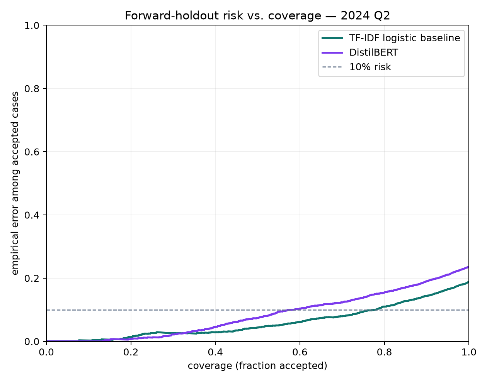
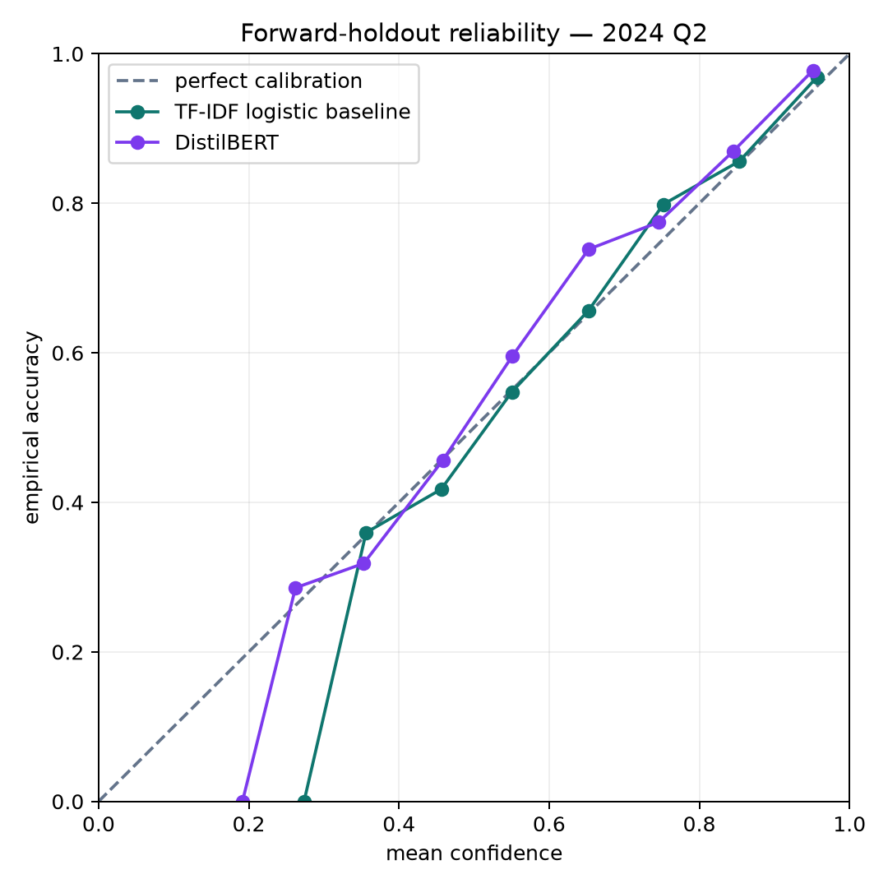

# 2024 Q2 forward-holdout results

Protocol ID: `fci.forward-holdout.2024q2.v1`

Evaluation status: completed on 2026-08-07 against the frozen Q2 snapshot.

The protocol and evaluation code were pushed in commit
`e07f4d127d4ed4e0ac4286db22f63bbeb47b8f39` before Q2 acquisition. A pre-results
transport amendment was pushed in commit
`17f156a3e0513af2018f62012752d157b170a059` after the filtered CFPB export failed but
before any Q2 row, prediction, or outcome was acquired or inspected. The models, data
window, sampling, metrics, and decision rules did not change.

## Verdict

Both preregistered follow-up rules passed.

1. **The baseline advantage transferred.** The TF-IDF/logistic model exceeded DistilBERT
   by **0.0500 macro-F1** on the untouched Q2 holdout. The paired 95% bootstrap interval
   was **+0.0362 to +0.0634**, entirely above zero.
2. **The baseline review policy transferred.** Its threshold, selected only on Q1
   calibration data, accepted **2,839 of 3,664 Q2 cases (77.48% coverage)** at **90.07%
   accuracy**. The Wilson 95% interval was **88.91% to 91.11%**, satisfying the frozen
   point-accuracy, lower-bound, and coverage rule.

This supports advancing the simpler baseline for further research. It does not authorize
automated complaint routing or establish production readiness.

## Forward-holdout performance

| Model | Q2 macro-F1 | Bootstrap 95% interval | Accuracy | NLL | 15-bin ECE |
| --- | ---: | ---: | ---: | ---: | ---: |
| TF-IDF + logistic regression | **0.8040** | 0.7903–0.8162 | **0.8111** | **0.5910** | **0.0167** |
| DistilBERT | 0.7540 | 0.7391–0.7681 | 0.7642 | 0.7251 | 0.0377 |

The baseline again had higher F1 in all eight product classes. The smallest Q2 gap was for
student loans (0.9347 versus 0.9265); the largest was for money transfer or service (0.7926
versus 0.7088). This is evidence about these exact frozen models and data windows, not a
general claim that linear models outperform transformers.

## Review-policy tradeoff

| Frozen policy | Accepted | Coverage | Accepted accuracy | Wilson 95% interval | Sent to review |
| --- | ---: | ---: | ---: | ---: | ---: |
| Calibrated baseline | 2,839 | **77.48%** | 90.07% | 88.91%–91.11% | 825 |
| Calibrated DistilBERT | 1,829 | 49.92% | **92.56%** | 91.27%–93.68% | 1,835 |

DistilBERT's accepted subset was more accurate, but it deferred 1,010 more complaints than
the baseline. The baseline offered substantially more coverage near the calibration-set 90%
target. Neither confidence threshold is a guarantee, and every consequential action still
requires human judgment.





## Data and provenance

The official [CFPB Consumer Complaint Database](https://www.consumerfinance.gov/data-research/consumer-complaints/)
full CSV snapshot was filtered locally to 2024-04-01 through 2024-06-30. The acquisition
sampled up to 500 rows for each frozen product label, excluded exact duplicates and
cross-label conflicts, then removed 37 normalized narratives overlapping any Q1 split.

- final holdout: 3,664 records;
- snapshot SHA-256: `cf18cfbc46d496ffc12f2e320ae38e533aa6b4813e7ecabac31c63623dc224a2`;
- holdout content SHA-256: `6a285f1696c4c6972569631edb594d79389ce05496011f62f9564210c3e7b251`;
- baseline artifact SHA-256: `89ce076d96fce2f3af3d299de31761c7ff74228061172dcf3175583df22eb2b7`;
- transformer weights SHA-256: `966335a40cc53de5c1051b3ff3037a96d7f741c322aefbfb763d1be9cc216327`;
- aggregate evidence verifier SHA-256: `e01ea8837f96feeee93c42983878aef418e49df83a885d60aa238a57d6e1561b`.

The [aggregate manifest](../artifacts/forward_holdout_manifest.json) and
[aggregate metrics](../artifacts/forward_holdout_metrics.json) contain the complete public
evidence. Raw narratives, complaint IDs, issues, model weights, and row-level predictions
remain local and outside GitHub.

## Reproduction boundary

After reproducing the original Q1 data and model artifacts locally:

```bash
python scripts/fetch_forward_holdout.py
python scripts/run_forward_holdout.py
python scripts/verify_forward_holdout.py
```

The source database can revise historical records, so a later download may have a different
snapshot digest or sample. Reproducing the exact reported result requires the snapshot and
artifact hashes above; publishing those private-local inputs is intentionally out of scope.

## Remaining limits

- Q1 and Q2 are adjacent 2024 quarters, not long-horizon or current-traffic validation.
- Exact-hash filtering does not detect paraphrases, templated near-duplicates, or shared
  boilerplate across periods.
- Deduplication after fixed per-product sampling reduced some class counts, especially debt
  collection and credit reporting; macro-F1 limits but does not remove that concern.
- No institution-external, protected-group, language, dialect, semantic-shift, adversarial,
  latency, cost, or live-reviewer evaluation was performed.
- CFPB complaints are self-selected public reports, not a representative customer sample or
  verified account of events.

The strongest honest conclusion is that the simpler baseline's advantage and calibrated
review policy transferred to this one preregistered future quarter. Production usefulness
and human acceptance remain unproved.
